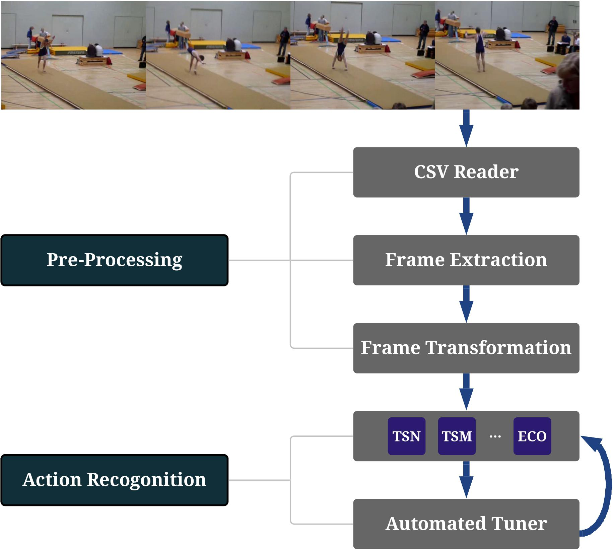

# AutoVideo: An Automated Video Action Recognition System


AutoVideo is a system for automated video analysis. It is developed based on [D3M](https://gitlab.com/datadrivendiscovery/d3m) infrastructure, which describes machine learning with generic pipeline languages. Currently, it focuses on video action recognition, supporting various state-of-the-art video action recognition algorithms. It also supports automated model selection and hyperparameter tuning. AutoVideo is developed by [DATA Lab](http://faculty.cs.tamu.edu/xiahu/) at Texas A&M University.

There are some other video analysis libraries out there, but this one is designed to be highly modular. AutoVideo is highly extendible thanks to the pipeline language, where each model is wrapped as a primitive with some hyperparameters. This allows us to easily support other algorithms for other video analysis tasks, which will be our future efforts. It is also convenient to search models and hyperparameters with the pipeline language.


An overview of the library is shown as below. Each module in AutoVideo is wrapped as a primitive with some hyperparameters. A pipeline consists of a series of primitives from pre-processing to action recognition. AutoVideo is equipped with tuners to search models and hyperparameters. We welcome contributions to enrich AutoVideo with more primitives. You can find instructions in [Contributing Guide](./CONTRIBUTING.md).



## Cite this work
If you find this repo useful, you may cite:

## Installation
Make sure that you have **Python 3.6** and **pip** installed. First, install `torch` and `torchvision` with
```
pip3 install torch
pip3 install torchvision
```
To use the automated searching, you need to install ray-tune and hyperopt with
```
pip3 install 'ray[tune]' hyperopt
```
We recommend installing the stable version of `autovideo` with `pip`:
```
pip3 install autovideo
```
Alternatively, you can clone the latest version with
```
git clone https://github.com/datamllab/autovideo.git
```
Then install with
```
cd autovideo
pip3 install -e .
```

## Toy Examples
To try the examples, you may download `hmdb6` dataset, which is a subset of `hmdb51` with only 51 classes. All the datasets can be downloaded from [Google Drive](https://drive.google.com/drive/folders/13oVPMyoBgNwEAsE_Ad3XVI1W5cNqfvrq). Then, you may unzip a dataset and put it in [datasets](datasets/).
### Fitting and saving a pipeline
```
python3 examples/fit.py
```
Some important hyperparameters are as follows.
*   `--alg`: the supported algorithm. Currently we support `tsn`, `tsm`, `i3d`, `eco`, `eco_full`, `c3d`, `r2p1d`, and `r3d`.
*   `--pretrained`: whether loading pre-trained weights and fine-tuning.
*   `--gpu`: which gpu device tp use. Empty string for CPU. 
*   `--data_dir`: the directory of the dataset
*   `--log_dir`: the path for sainge the log
*   `--save_dir`: the path for saving the fitted pipeline

### Loading a fitted pipeline and producing predictions
After fitting a pipeline, you can load a pipeline and make predictions.
```
python3 examples/produce.py
```
Some important hyperparameters are as follows.
*   `--gpu`: which gpu device tp use. Empty string for CPU. 
*   `--data_dir`: the directory of the dataset
*   `--log_dir`: the path for sainge the log
*   `--load_dir`: the path for loading the fitted pipeline

### Loading a fitted pipeline and recogonizing actions
After fitting a pipeline, you can also make predicitons on a single video. As a demo, you may download the fitted pipeline and the demo video from [Google Drive](https://drive.google.com/drive/folders/1j4iGUQG3m_TXbQ8mQnaR_teg1w0I2x60). Then, you can use the following command to recogonize the action in the video:
```
python3 examples/recogonize.py
```
Some important hyperparameters are as follows.
*   `--gpu`: which gpu device tp use. Empty string for CPU. 
*   `--video_path`: the path of video file
*   `--log_dir`: the path for sainge the log
*   `--load_dir`: the path for loading the fitted pipeline

### Fitting and producing a pipeline
Alternatively, you can do `fit` and `produce` without saving the model with
```
python3 examples/fit_produce.py
```
Some important hyperparameters are as follows.
*   `--alg`: the supported algorithm.
*   `--pretrained`: whether loading pre-trained weights and fine-tuning.
*   `--gpu`: which gpu device tp use. Empty string for CPU. 
*   `--data_dir`: the directory of the dataset
*   `--log_dir`: the path for sainge the log

### Automated searching
In addition to running them by yourself, we also support automated model selection and hyperparameter tuning:
```
python3 examples/search.py
```
Some important hyperparameters are as follows.
*   `--alg`: the searching  algorithm. Currently, we support `random` and `hyperopt`.
*   `--num_samples`: the number of samples to be tried
*   `--gpu`: which gpu device tp use. Empty string for CPU. 
*   `--data_dir`: the directory of the dataset

## Supported Algorithms

| Algorithms | Primitive Path                                                                             | Paper                                                                                                                    | 
| :--------: | :----------------------------------------------------------------------------------------- | :----------------------------------------------------------------------------------------------------------------------- | 
| TSN        | [autovideo/recognition/tsn_primitive.py](autovideo/recognition/tsn_primitive.py)           |  [Temporal Segment Networks: Towards Good Practices for Deep Action Recognition](https://arxiv.org/abs/1608.00859)       |
| TSM        | [autovideo/recognition/tsm_primitive.py](autovideo/recognition/tsm_primitive.py)           |  [TSM: Temporal Shift Module for Efficient Video Understanding](https://arxiv.org/abs/1811.08383)                        |
| R2P1D      | [autovideo/recognition/r2p1d_primitive.py](autovideo/recognition/r2p1d_primitive.py)       |  [A Closer Look at Spatiotemporal Convolutions for Action Recognition](https://arxiv.org/abs/1711.11248)                 |
| R3D        | [autovideo/recognition/r3d_primitive.py](autovideo/recognition/r3d_primitive.py)           |  [Learning spatio-temporal features with 3d residual networks for action recognition](https://arxiv.org/abs/1708.07632)  |
| C3D        | [autovideo/recognition/c3d_primitive.py](autovideo/recognition/c3d_primitive.py)           |  [Learning Spatiotemporal Features with 3D Convolutional Networks](https://arxiv.org/abs/1412.0767)                      | 
| ECO-Lite   | [autovideo/recognition/eco_primitive.py](autovideo/recognition/eco_primitive.py)           |  [ECO: Efficient Convolutional Network for Online Video Understanding](https://arxiv.org/abs/1804.09066)                 | 
| ECO-Full   | [autovideo/recognition/eco_full_primitive.py](autovideo/recognition/eco_full_primitive.py) |  [ECO: Efficient Convolutional Network for Online Video Understanding](https://arxiv.org/abs/1804.09066)                 | 
| I3D        | [autovideo/recognition/i3d_primitive.py](autovideo/recognition/i3d_primitive.py)           |  [Quo Vadis, Action Recognition? A New Model and the Kinetics Dataset](https://arxiv.org/abs/1705.07750)                 | 

## Advanced Usage
Beyond the above examples, you can also customize the configurations.

### Configuring the hypereparamters
Each model in AutoVideo is wrapped as a primitive, which contains some hyperparameters. An example of TSN is [here](autovideo/recognition/tsn_primitive.py#L31-78). All the hyperparameters can be specified when building the pipeline by passing a `config` dictionary. See [examples/fit.py](examples/fit.py#L40-42).

### Configuring the search space
The tuner will search the best hyperparamter combinations within a search sapce to improve the performance. The search space can be defined with ray-tune. See [examples/search.py](examples/search.py#L42-47).

## Preparing datasets and benchmarking
The datasets must follow d3m format, which consists of a csv file and a media folder. The csv file should have three columns to specify the instance indices, video file names and labels. An example is as below
```
d3mIndex,video,label
0,Aussie_Brunette_Brushing_Hair_II_brush_hair_u_nm_np1_ri_med_3.avi,0
1,brush_my_hair_without_wearing_the_glasses_brush_hair_u_nm_np1_fr_goo_2.avi,0
2,Brushing_my_waist_lenth_hair_brush_hair_u_nm_np1_ba_goo_0.avi,0
3,brushing_raychel_s_hair_brush_hair_u_cm_np2_ri_goo_2.avi,0
4,Brushing_Her_Hair__[_NEW_AUDIO_]_UPDATED!!!!_brush_hair_h_cm_np1_le_goo_1.avi,0
5,Haarek_mmen_brush_hair_h_cm_np1_fr_goo_0.avi,0
6,Haarek_mmen_brush_hair_h_cm_np1_fr_goo_1.avi,0
7,Prelinger_HabitPat1954_brush_hair_h_nm_np1_fr_med_26.avi,0
8,brushing_hair_2_brush_hair_h_nm_np1_ba_med_2.avi,0
```
The media folder should contain video files. You may refer to our example hmdb6 dataset in [Google Drive](https://drive.google.com/drive/folders/13oVPMyoBgNwEAsE_Ad3XVI1W5cNqfvrq). We have also prepared hmdb51 and ucf101 in the Google Drive for benchmarking. Please read [benchmark](docs/benchmark.md) for more details. For some of the algorithms (C3D, R2P1D and R3D), if you want to load the pre-trained weights and fine-tune, you need to download the weights from [Google Drive](https://drive.google.com/drive/folders/1fABdnH-l92q2RbA8hfQnUPZOYoTZCR-Q) and put it to [weights](weights).

## Acknowledgement
We gratefully acknowledge the Data Driven Discovery of Models (D3M) program of the Defense Advanced Research Projects Agency (DARPA).
